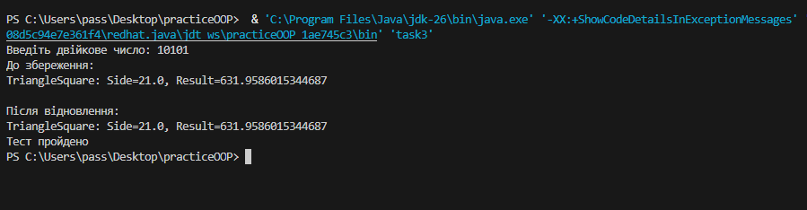

## Завдання 3
    1. Як основа використовувати вихідний текст проекту попередньої лабораторної роботи. Забезпечити розміщення результатів обчислень уколекції з можливістю збереження/відновлення.
    2. Використовуючи шаблон проектування Factory Method (Virtual Constructor), розробити ієрархію, що передбачає розширення рахунок додавання нових відображуваних класів.
    3. Розширити ієрархію інтерфейсом "фабрикованих" об'єктів, що представляє набір методів для відображення результатів обчислень.
    4. Реалізувати ці методи виведення результатів у текстовому вигляді.
    5. Розробити тареалізувати інтерфейс для "фабрикуючого" методу.

## Робота програми

## Код

[Переглянути код](../src/task3.java)