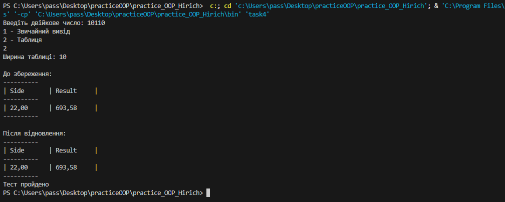

## Завдання 4
    1. За основу використовувати вихідний текст проекту попередньої лабораторної роботи. Використовуючи шаблон проектування Factory Method (Virtual Constructor), розширити ієрархію похідними класами, реалізують методи для подання результатів у вигляді текстової таблиці. Параметри відображення таблиці мають визначатися користувачем.
    2. Продемонструвати заміщення (overriding), поєднання (overloading), динамічне призначення методів (Пізнє зв'язування, поліморфізм, dynamic method dispatch).
    3. Забезпечити діалоговий інтерфейс із користувачем.
    4. Розробити клас для тестування основної функціональності.
    5. Використати коментарі для автоматичної генерації документації засобами javadoc.

## Робота програми

## Код

[Переглянути код](../src/task4.java)