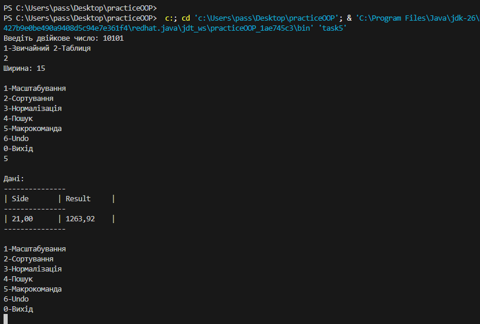

## Завдання 5
    1. Використовуючи створені раніше класи та шаблон проектування Command, розробити клас Menu як контейнер команд, що розширюється,
       реалізувати обробку даних колекції та окремих елементів (масштабування, інтерполяція, нормалізація, сортування, пошук і т.д.).
    2. Реалізувати можливість скасування (undo) операцій (команд).
    3. Продемонструвати поняття "макрокоманда".
    4. Під час розробки програми використовувати шаблон Singletone.
    5. Забезпечити діалоговий інтерфейс із користувачем.
    6. Розробити клас для тестування функціональності програми.
    7. Використати коментарі для автоматичного створення документації засобами javadoc.

## Робота програми

## Код

[Переглянути код](../src/task5.java)