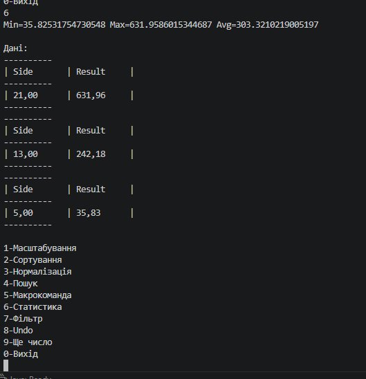

## Завдання 6
    1. Продемонструвати можливість паралельної обробки елементів колекції (пошук мінімуму, максимуму, обчислення середнього значення, відбір за
       критерієм, статистична обробка тощо).
    2. Управління чергою завдань (команд) реалізувати за допомогою
       шаблону Worker Thread.
    3. Забезпечити діалоговий інтерфейс з користувачем.
    4. Розробити клас для тестування функціональності програми.
    5. Використовувати коментарі для автоматичного створення документації
       засобами javadoc.

## Робота програми

## Код

[Переглянути код](../src/task6.java)